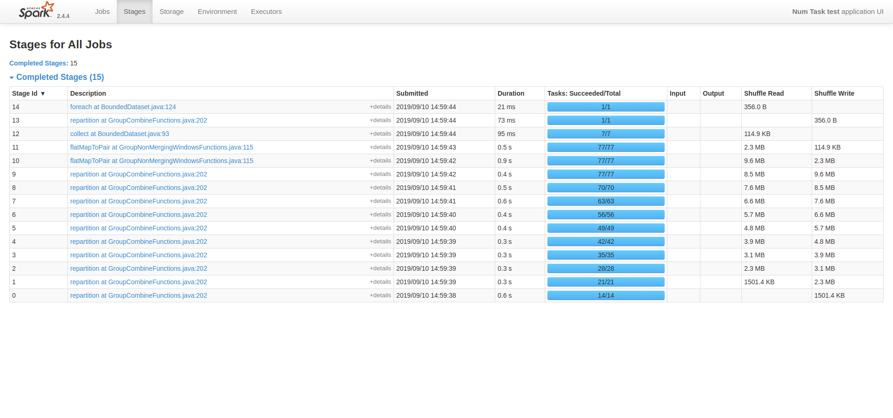

# Tasks per Stage Can Grow Unbounded in Spark Runner

The code in this repository demonstrates an issue that we have found when running our
pipelines with the latest Beam 2.15.0 on Spark 2.4.4.

## Versions
Beam 2.15.0

Spark 2.4.4

## Test Code
The test in src/test/java contains a JUnit test that will create a list of  PCollections and flatten them.
In between `flatten` operations, a `reshuffle` is used to create new stages in Spark. This makes it easier
 to demonstrate the core issue, but without reshuffle the same issue exists.

When running the test, each stage that contains a flatten will have more tasks than the one before.



## Analysis

[This is in line with the flatten implementation in TransformTranslator](https://github.com/apache/beam/blob/master/runners/spark/src/main/java/org/apache/beam/runners/spark/translation/TransformTranslator.java#L101).
The code will perform a Spark union operation, which will result in a UnionRDD that is the combination of 
the original RDDs and also contains the union of the partitions.

Note: There is a special case in the union operation when all RDDs share the same partitioner. If that happens
the union will get a `PartitionerAwareUnionRDD` that will probably not have this issue. For some reason, the
 UnionRDD is used, although both RDDs contain 7 partitions and both probably use the 
[HashPartitioner](https://github.com/apache/spark/blob/master/core/src/main/scala/org/apache/spark/Partitioner.scala#L122).

Because the number of partitions in the union is the sum of the partitions in the originating RDDs, the 
number of partitions continues to grow.

In this example this is not really an issue, but we have a pipeline that runs on 150 machines where the 
number of partitions can really get out of hand due to this (500k+ partitions). This many partitions/tasks 
overloads the driver and crashes the pipeline.

## Possible Solution

A fairly easy solution is to add an extra `coalesce` operation after the `union` to reduce the number of
partitions back to the default. In our experiments this seems to work very well.

```java
  unionRDD =
      context
          .getSparkContext()
          .union(rdds)
          .coalesce(context.getSparkContext().defaultParallelism(), false);
```